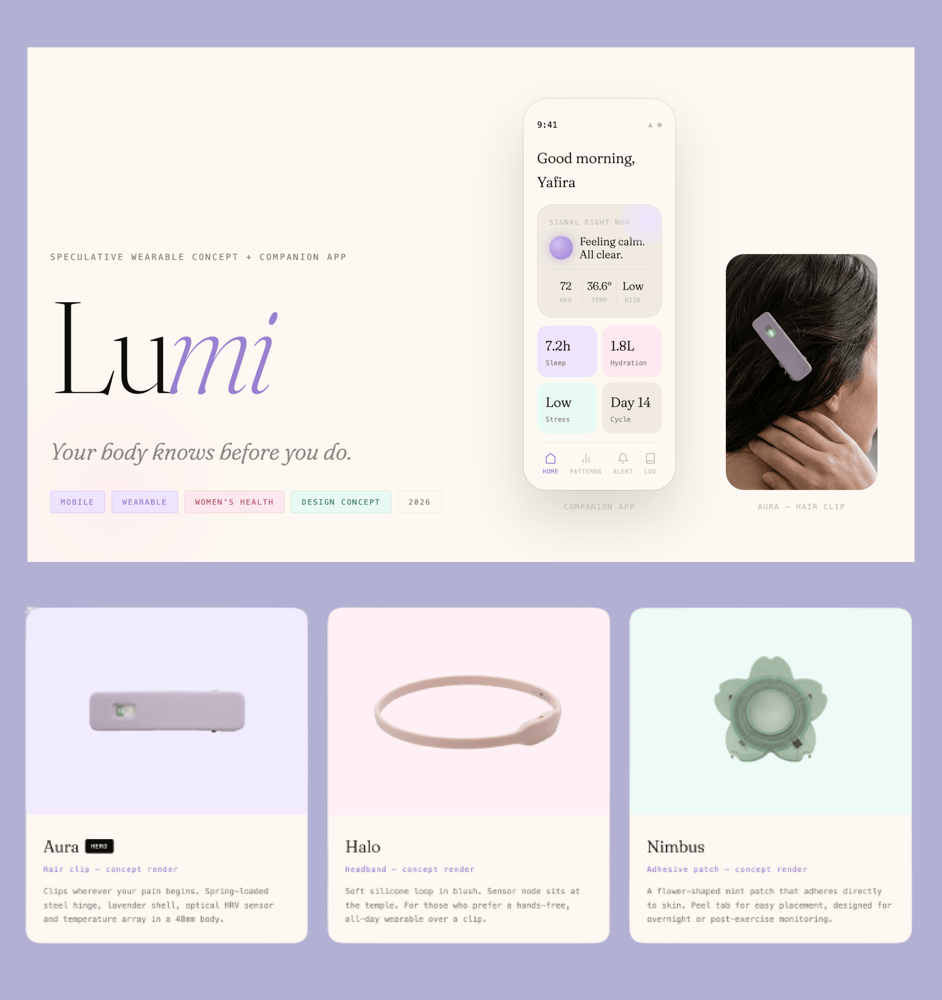
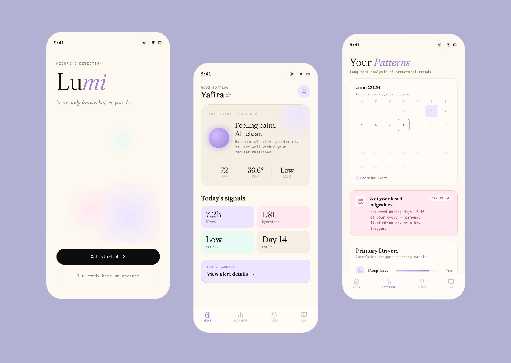

# Lumi — Speculative Wearable Concept + Companion App

**Your body knows before you do.**

[Case Study](https://lumi-case-study.vercel.app) · [Live Prototype](https://lumi-wearable.vercel.app)

---

## Overview

Lumi is a speculative wearable biosensor and companion app designed to detect the migraine prodrome window — the 4–72 hour period before an attack where subtle physiological shifts in HRV, skin temperature, and cortisol signal what's coming. Instead of reacting to pain after it starts, Lumi gives you time to act before it does.

Migraines affect over 1 billion people worldwide. Women are 3.25× more likely to experience them than men — yet most detection tools are reactive and built around male bodies as the default. Lumi is explicitly designed for and around women's health.

This project began personally. I've had migraines since I was a teenager and wanted to build something that could read the early signs so I didn't have to consciously track them.

---

## What's in This Repo

This repo contains the **companion app prototype** — a fully interactive mobile UI built in React + TypeScript, simulating the complete Lumi experience from onboarding to early warning alert to pattern tracking.

**Screens included:**

- Onboarding flow
- Dashboard with live signal orb (calm / medium / warning states)
- Early warning alert + action checklist
- Patterns calendar with day comparison
- Categorized symptom log (hormonal, lifestyle, aura, attack)

---

## Tech Stack

- **React + TypeScript** — component architecture and type safety
- **Vite** — build tooling
- **Vercel** — deployment
- **Fraunces + Departure Mono** — typefaces
- **Lucide Icons** — iconography
- Simulated biosensor data (no real hardware connection in prototype)

---

## Hardware Concepts

The wearable hardware is a **speculative design concept** — not yet manufactured. Three form factors share the same optical HRV sensor core:

| Device     | Form Factor            | For                                   |
| ---------- | ---------------------- | ------------------------------------- |
| **Aura**   | Hair clip (hero)       | Clips wherever your pain begins       |
| **Halo**   | Soft silicone headband | Hands-free, all-day wear              |
| **Nimbus** | Adhesive skin patch    | Overnight or post-exercise monitoring |

All renders are speculative. Sensor specifications are grounded in published HRV and biosensor research but do not represent a real product. If you're a hardware engineer or medical device designer interested in building this — [let's talk](mailto:yafira@proton.me).

---

## Design Approach

Lumi was designed in the browser, not before it. No static Figma handoff — every screen was built, viewed, adjusted, and rebuilt in the same environment. Spacing, color, motion, and copy were tuned by changing code and watching the result update immediately.

Key design principles:

- **Calm technology** — the signal orb communicates status without demanding attention
- **For women, by a woman** — cycle tracking, hormonal trigger mapping, and language all reflect women's health intent
- **Accessible by default** — three form factors so the choice of hardware is never a compromise on capability

---

## Research Basis

1. Vetvik & MacGregor (2017). Sex differences in migraine epidemiology. _The Lancet Neurology._ — source for the 3.25× figure
2. GBD 2016 Collaborators (2017). _The Lancet._ — source for 1B+ affected and #4 disability ranking
3. Giffin et al. (2003). Premonitory symptoms in migraine. _Neurology._ — source for the 4–72h prodrome window
4. Shaffer & Ginsberg (2017). HRV metrics and norms. _Frontiers in Public Health._ — basis for HRV as a biosensor signal
5. Peroutka (2014). Migraine as a sympathetic nervous system disorder. _Headache._ — basis for cortisol and temperature as prodrome markers

---

## About

A project by [Yafira Martinez](https://yafira.xyz)

[Case Study](https://lumi-case-study.vercel.app) · [Portfolio](https://yafira.xyz) · [Contact](mailto:yafira@proton.me)
